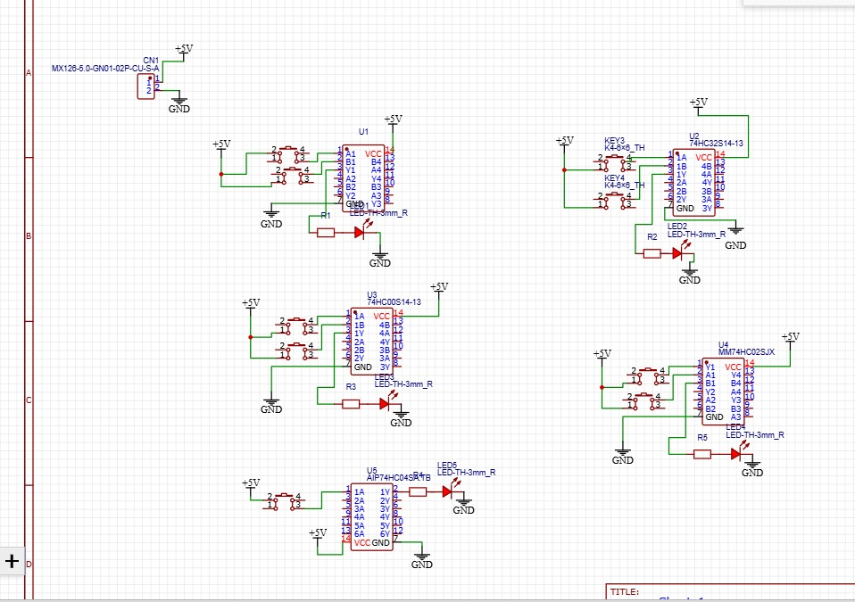

# Logic Gate Circuit Design using IC and PCB Fabrication  

Design and implement basic digital logic gate circuits — AND, OR, NAND, NOR, and NOT — using standard TTL ICs such as 7408, 7432, 7400, 7402, and 7404, and develop a single-layer PCB for the same. The project aims to create functional gate circuits that can demonstrate the logical operations using input switches and output LEDs, verify their truth tables through hardware testing, and fabricate a compact PCB layout integrating all gates for educational and laboratory applications.

## Circuit Diagram

