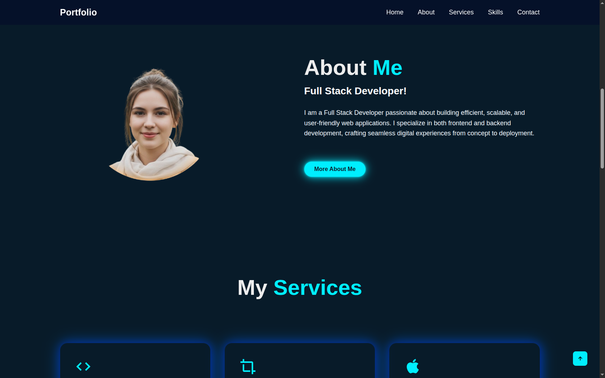

# Portfolio Website  

## Task 3  
The objective of this task is to **design and develop a personal portfolio website** using **HTML and CSS**.  
The goal is to create a **visually appealing and well-structured** web page that effectively showcases an individual's **profile, skills, projects, achievements, and contact information**.  

This project focuses on demonstrating proficiency in **HTML** for webpage structure and **CSS** for layout design, color schemes, typography, and responsiveness.  
The portfolio should provide an **engaging user experience** while reflecting the designer’s **creativity and technical abilities**.  

The task aims to help learners understand how to **build a professional online presence** using core web development technologies **without relying on frameworks or JavaScript**.  

## 🚀 Demo Site  
🔗 [Visit the Portfolio Website](https://portfolio-home-nav-ui.vercel.app/)  

