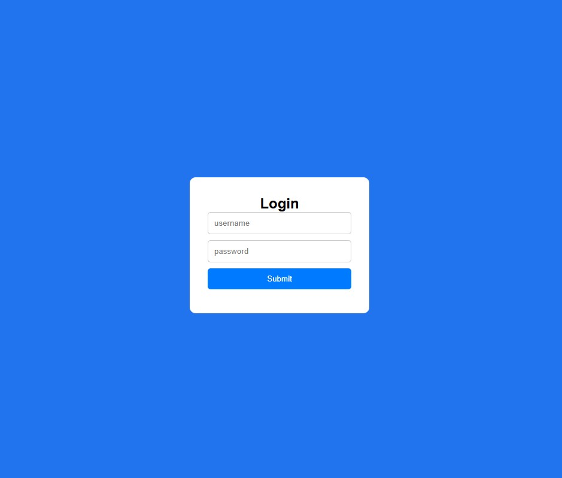

# Task -1
The objective of Task 1 is to design and develop a simple login page using HTML and CSS to demonstrate the fundamentals of web interface creation and styling. The task focuses on creating a visually appealing and user-friendly login form that allows users to enter their credentials (username and password) in a structured layout. The project aims to enhance understanding of basic web page structure, layout design using CSS, and principles of responsive and aesthetic interface development.

## demo site
https://mechatronics-skill.vercel.app/

