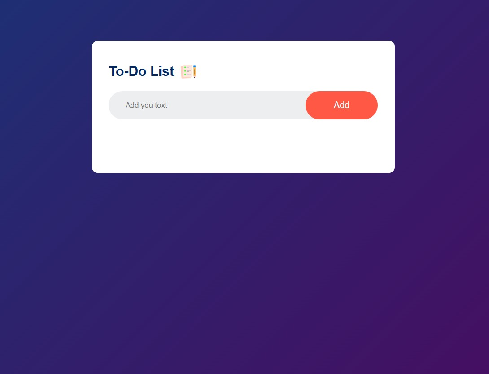

# To-Do-List
## Task
The objective of this task is to design and develop a dynamic To-Do List web application using HTML, CSS, and JavaScript. The goal is to create an interactive and user-friendly interface that allows users to add, view, edit, and delete tasks efficiently.The project aims to demonstrate the integration of HTML for structuring content, CSS for designing and styling the interface, and JavaScript for implementing interactive functionalities such as task management and real-time updates.

Through this task, learners will understand how to combine front-end technologies to build a responsive and functional web application that helps users organize and track their daily activities effectively.

## Demo - site: https://mechatronics-skill-2edp.vercel.app/

